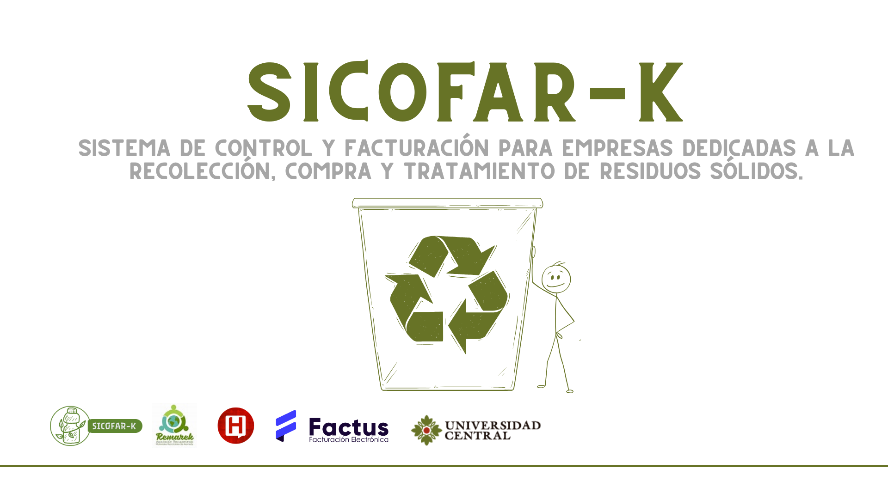

  

# SICOFAR-K

**SICOFAR-K** es la respuesta digital a las necesidades identificadas: una plataforma web integral para la gestión, trazabilidad y transparencia en la operación de bodegas de reciclaje, optimizando cada etapa desde el ingreso del material hasta la facturación y el control de inventarios.

### Principales Deficiencias Detectadas

| Problema                                              |                                                                                       |
|-------------------------------------------------------|---------------------------------------------------------------------------------------------------------------------------------------------------------------------------------------------------------------------------------------------|
| **Falta de control eficiente del ingreso de materiales**    |                                   |
| **Proceso de facturación ambiguo y rudimentario**     |                                         |
| **Desconexión entre material ingresado y procesado**  |  |

---

## Tecnologías Usadas

- Backend:        
- Frontend:   
- Base de Datos: 
- Otros: 

---

## 📚 Documentación

Para documentación técnica detallada del proyecto, consulta nuestra [Wiki](https://github.com/jnavarrop26/sicofar-k/wiki):

- **[Inicio](https://github.com/jnavarrop26/sicofar-k/wiki/Home)** - Bienvenida y tabla de contenidos
- **[Arquitectura del Sistema](https://github.com/jnavarrop26/sicofar-k/wiki/arquitectura)** - Diseño arquitectónico completo
- **[Base de Datos](https://github.com/jnavarrop26/sicofar-k/wiki/base-datos)** - Modelo de datos, entidades y relaciones
- **[Casos de Uso](https://github.com/jnavarrop26/sicofar-k/wiki/casos-de-uso)** - Especificación detallada de casos de uso
- **[Requerimientos Funcionales](https://github.com/jnavarrop26/sicofar-k/wiki/requerimientos-funcionales)** - Requisitos funcionales del sistema
- **[Requerimientos No Funcionales](https://github.com/jnavarrop26/sicofar-k/wiki/requerimientos-no-funcionales)** - Requisitos no funcionales
- **[Reglas de Negocio](https://github.com/jnavarrop26/sicofar-k/wiki/reglas-negocio)** - Reglas y validaciones de negocio

---

## 🚀 Estado del Proyecto

---

## 📞 Contacto

**Equipo de Desarrollo SICOFAR-K**  
Universidad Central  
📧 Email: jnavarrop26@ucentral.edu.co
